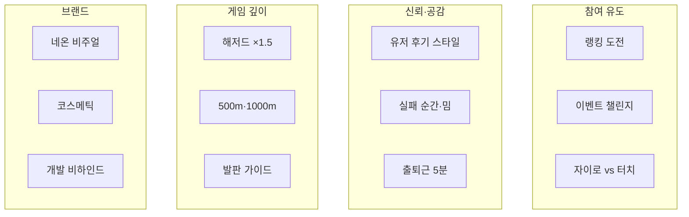

# NeoFall 홍보 배리에이션 라이브러리

> 각 문구 **5줄 이내**. 같은 각도라도 플랫폼마다 문장 구조를 다르게 작성.
> 자동 로테이션: `promo_automation/neofall_variations.json`

---

## 각도(Angle) 인덱스



| 코드 | 각도 | 언제 쓰나 |
|------|------|-----------|
| `ranking_challenge` | 랭킹 도전 | 주 1회, 업데이트 후 |
| `user_review` | 유저 후기 스타일 | 신규 유저 유입기 |
| `fail_moment` | 실패·밈 | Shorts/TikTok, X |
| `gyro_vs_touch` | 조작 대결 | 토론 유도할 때 |
| `hazard_gamble` | 해저드 도박 | 하이스코어 유저 타깃 |
| `depth_milestone` | 500m·1000m | 챌린지 이벤트 |
| `commute_game` | 출퇴근 5분 | 평일 오전·저녁 |
| `cosmetic` | 꾸미기 | 상점·코인 소구 |
| `dev_story` | 개발 비하인드 | Reddit, X |
| `question` | 질문형 | Threads, Discord |
| `newbie_tip` | 초보 팁 | 신규 유저 온보딩 |
| `neon_aesthetic` | 네온 비주얼 | 영상 채널 |
| `platform_guide` | 발판 가이드 | Shorts 교육형 |
| `event_challenge` | 커뮤니티 챌린지 | Discord, X |

---

## 주간 로테이션 예시

| 요일 | X | Threads | Shorts/TikTok | Discord |
|------|---|---------|---------------|---------|
| 월 | 랭킹 도전 | 질문형 | 랭킹 챌린지 영상 | 주간 챌린지 공지 |
| 화 | 유저 후기 | 유저 후기 | "한 판만" 밈 | 후기 수집 |
| 수 | 해저드 | 해저드 토론 | 해저드 도박 | — |
| 목 | 자이로 vs 터치 | 조작 투표 | 터치/자이로 비교 | 터치파 vs 자이로파 |
| 금 | 출퇴근 5분 | 초보 팁 | 발판 가이드 | 초보 팁 |
| 토 | 네온 비주얼 | — | aesthetic 영상 | 꾸미기 자랑 |
| 일 | 이벤트 | — | 실패 모음 | 주간 결과 발표 |

---

## X — 배리에이션 10종

### V1 · 랭킹 도전
```
NeoFall 랭킹 도전 🔥
터치 Top 100 / 자이로 Top 100 따로 있습니다
어느 쪽이 더 상위권일까요?
내 기록: ___m — 이겨보실 분
#NeoFall #하이스코어
```

### V2 · 500m 챌린지
```
이번 주 NeoFall 챌린지
500m 넘기면 인정
1000m 넘기면 존경
스크린샷 인증 환영
당신의 깊이는?
```

### V3 · 유저 후기 (한 판만)
```
"그냥 한 판만" 하다가 40분 지난 사람 손 ✋
NeoFall — 네온 무한 낙하
빨간 바닥만 피하면 된다고 생각했는데
500m부터 바닥이 움직임
나만 그런 거 아니지?
```

### V4 · 유저 후기 (친구 대화)
```
친구: 이거 뭐냐
나: NeoFall. 낙하 게임
친구: (5분 후) 자이로가 더 어렵네
나: 랭킹도 따로야
친구: ...설치함
```

### V5 · 해저드
```
해저드 아이템 먹으면
화면 뒤집히고 속도 올라가고
점수는 1.5배
NeoFall — 욕하면서 또 함
감당 가능?
```

### V6 · 자이로 vs 터치
```
NeoFall 터치파 vs 자이로파
터치: 정밀함의 미학
자이로: 손목 스포츠
랭킹 따로 있으니 말로만 하지 말고 증명
어느 쪽?
```

### V7 · 출퇴근
```
지하철 5정거장 = NeoFall 3판
한 판 1~2분, 재시작 바로 됨
게스트로 바로 시작
내릴 때까지 깊이 ___m
출퇴근 게임 찾는 사람에게
```

### V8 · 실패 밈
```
노란 발판 밟았더니
깨지면서 떨어짐
GAME OVER
NeoFall이 나한테 한 말: "다시 해"
그래서 다시 함
```

### V9 · 네온 비주얼
```
어두운 배경에 네온만 켜진 느낌
떨어질수록 속도선 늘어남
BGM도 빨라짐
NeoFall — 눈이 즐거운 낙하
영상으로 보는 게 더 낫다
```

### V10 · 이벤트
```
🏆 NeoFall 깊이 챌린지
규칙: 스크린샷 + 깊이(m) 댓글
이번 주 목표 800m
달성자 shoutout
참여 GO
```

---

## Threads — 배리에이션 5종

### V1 · 랭킹
```
NeoFall 랭킹 보는데 터치 1위랑 자이로 1위 깊이가 다르더라
같은 게임인데 조작만 바꿔도 난이도가 완전 달라짐
여러분은 몇 m까지 가봤어요?
랭킹 올라간 사람 있으면 공유해주세요
```

### V2 · 유저 후기
```
NeoFall 해본 사람? 솔직 후기 궁금해요
저는 "한 판만"이 없어서 출근 지각할 뻔
해저드 먹었다가 죽으면 화나는데 점수는 오름
이 감정 아는 사람?
```

### V3 · 해저드 토론
```
점수 올리려면 해저드 아이템 먹어야 할까요?
NeoFall은 먹으면 난이도 확 올라가는데 ×1.5 점수
안전하게만 가면 랭킹 한계가 있을 것 같아서
여러분은 도박파? 안정파?
```

### V4 · 자이로 vs 터치
```
무한 낙하 게임 NeoFall에서
터치랑 자이로 중 뭐가 더 어렵다고 느끼세요?
저는 자이로가 손목 아프지만 더 몰입됨
랭킹도 분리돼 있어서 공정하게 겨룸
```

### V5 · 초보 팁
```
NeoFall 처음 하는 사람 팁
빨간 발판 = 무조건 피하기
초록 = 튕겨서 살기 좋음
노란 = 밟으면 깨짐 (타이밍)
이것만 알아도 200m는 감
```

---

## Reddit — 배리에이션 5종

### V1 · r/IndieDev — 랭킹
```
NeoFall update: separate touch vs gyro leaderboards (Top 100 each).
Wanted fair competition — gyro mains kept losing to touch on one board.
Which mode do you think will have higher scores?
Would love testers to break the rankings.
```

### V2 · r/playmygame — 유저 후기 톤
```
A player told me: "I said one more try at 11pm. It was 1am."
NeoFall — neon endless-fall. Red = death, green = bounce.
Hazard pickups flip the screen but give ×1.5 score.
What's the deepest you've fallen?
```

### V3 · r/androiddev — 개발
```
Shipped NeoFall: Flutter + Flame + Forge2D endless-fall.
Guest play first, Google login later with record merge.
Supabase dual leaderboards (touch/gyro) was trickier than physics.
AMA about the stack if useful.
```

### V4 · r/IndieDev — 실패 디자인
```
Designed yellow platforms to crack on contact.
Playtesters: "I bounced perfectly then the floor vanished."
500m+ moving platforms make it worse (better?).
Feedback on unfair deaths vs fun challenge?
```

### V5 · r/SideProject — 질문
```
NeoFall — neon ball falling through platform patterns.
Debate: should hazard items be opt-in or on the path?
Currently risky but ×1.5 score — most players grab them.
Do you reward greed or punish it?
```

---

## YouTube Shorts — 배리에이션 5종

| ID | 각도 | 대본 |
|----|------|------|
| V1 | 랭킹 | 700m...800m...빨간 발판!!! GAME OVER — 당신은 몇 m? |
| V2 | 유저 후기 | "한 판만" → 30분 지남 / NeoFall / 나만 중독? |
| V3 | 해저드 | 해저드 먹음 → 화면 뒤집힘 → 살았다/죽었다 |
| V4 | 발판 가이드 | 빨강=죽음 파랑=안전 초록=튕김 노랑=깨짐 |
| V5 | 자이로 | 터치 600m → 자이로 바꿈 → 완전 다른 게임 |

---

## TikTok — 배리에이션 5종

| ID | 각도 | 훅(첫 줄) |
|----|------|-----------|
| V1 | 랭킹 | NeoFall 1000m 가는 사람 있음? |
| V2 | 유저 후기 | 이 게임 하지 마세요 (역설 훅) |
| V3 | 실패 | 노란 바닥 믿었는데 밟자마자 깨짐 |
| V4 | 해저드 | 해저드 먹으면 점수 1.5배래서 먹음 |
| V5 | 네온 | 네온 게임 좋아하면 이거 |

---

## Discord — 배리에이션 5종

### V1 · 주간 챌린지
```
🏆 주간 깊이 챌린지 — 목표 600m
스크린샷 + 깊이(m) 댓글로 인증
터치/자이로 구분해서 올려주세요
현재 1위: ___m
```

### V2 · 후기 수집
```
오늘 NeoFall 처음 해본 사람?
첫인상 한 줄로 남겨주세요
"생각보다 어렵다" / "네온 예쁘다" 뭐든 OK
다음 업데이트에 반영할게요
```

### V3 · 터치 vs 자이로 투표
```
터치파 vs 자이로파 투표 🗳️
랭킹도 모드별로 나뉘어 있어요
댓글로 편 가르쳐주세요
다음 주에 결과 공유
```

### V4 · 꾸미기
```
🎨 나만의 NeoFall 룩 자랑
볼 스킨 + 꼬리 조합 스크린샷
제일 예쁜 조합 피처링
#꾸미기 채널에 올려주세요
```

### V5 · 초보 팁
```
💡 초보 팁: 초록=튕김, 노란=한 번만
500m 넘으면 바닥이 움직이기 시작
더 좋은 팁 있으면 공유해주세요
```

---

## Google Play — 배리에이션 4종

### V1 · 랭킹
```
NeoFall 랭킹 시즌 오픈!
터치·자이로 Top 100 따로 집계.
Google 로그인 후 전 세계 플레이어와 경쟁.
지금 도전하고 닉네임을 올려보세요.
```

### V2 · 유저 보이스
```
"출근길 한 판인데 500m 넘기기 빡세다"
"자이로 모드 해보니까 완전 다른 게임"
"해저드 먹었다가 죽었는데 점수는 확 오름"
직접 플레이하고 후기를 남겨보세요.
```

### V3 · 해저드
```
해저드 아이템 — 난이도 UP, 점수 ×1.5.
무적·실드와 조합하면 역전 가능.
안전 vs 도박, 선택은 당신의 몫.
```

### V4 · 꾸미기
```
볼 스킨 14종, 꼬리 6종.
회원가입 시 1,000코인 보너스.
랭킹은 실력, 스킨은 개성.
```

---

## 블로그 — 배리에이션 3종

| 제목 | 각도 |
|------|------|
| NeoFall 랭킹 공략 — 터치 vs 자이로 | ranking_challenge |
| "한 판만"이 없는 네온 낙하 게임 후기 | user_review |
| 출퇴근길 5분 게임 추천 — NeoFall | commute_game |

---

## 사용법

```bash
# JSON에서 특정 각도만 보기
# promo_automation/neofall_variations.json 참고

# 자동 파이프라인에 각도 지정 (추후)
python run_pipeline.py --all --angle ranking_challenge
```

**규칙**: 같은 주에 같은 각도를 3개 이상 채널에 쓰지 말 것. 각도는 같아도 **문장은 채널마다 다르게**.
