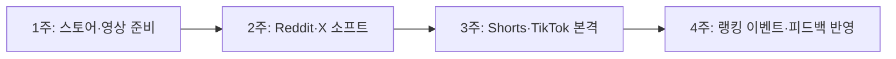
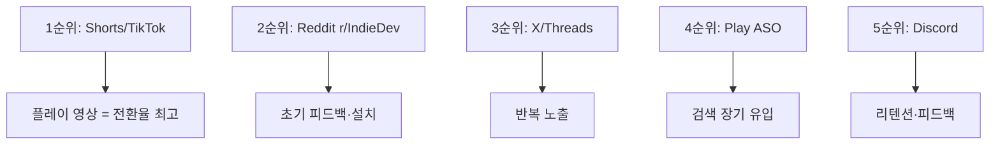

# NeoFall 홍보 전략 & 플랫폼별 문구

> 앱: **NeoFall** — 네온 스타일 무한 낙하 액션 (Flutter)
> 패키지: `com.neuralagent.neofall`
> 웹: https://nyhoon.github.io/NeoFallSite/

---

## 1. 핵심 포지셔닝

| 항목 | 내용 |
|------|------|
| 한 줄 | 네온 세계에서 떨어지며 깊이·점수에 도전하는 원핸드 액션 |
| 타깃 | 캐주얼 모바일 게이머, 하이스코어·랭킹 좋아하는 유저 |
| 차별점 | 터치/자이로 이중 조작 + 별도 랭킹, 해저드=점수×1.5, 네온 비주얼 |
| 톤 | 짧고 임팩트, 과장 금지, 플레이 영상 중심 |

---

## 2. 4주 홍보 로드맵



| 주차 | 채널 | 액션 |
|------|------|------|
| 1주 | Play, Discord | 스토어 등록, 스크린샷·Shorts 1개 촬영 |
| 2주 | Reddit, X, Threads | 개발기·질문형 글, 링크는 주 1~2회만 |
| 3주 | Shorts, TikTok, 블로그 | 플레이 영상 3종, SEO 글 1개 |
| 4주 | 전 채널 | 업데이트·랭킹 챌린지, 댓글 답변 집중 |

---

## 3. 플랫폼별 홍보 문구 (각 5줄 이내)

### Google Play — 변경사항

```
NeoFall v1.0 출시!
네온 세계에서 끝없이 낙하하며 깊이와 점수에 도전하세요.
터치·자이로 조작, 발판 5종, 버프·해저드 아이템.
Google 로그인으로 전 세계 랭킹 Top 100 경쟁.
볼 스킨·꼬리 꾸미기 상점도 만나보세요.
```

---

### Reddit — r/IndieDev (피드백 요청)

```
I built NeoFall — a neon endless-fall arcade game (Flutter + Flame).
You control a ball falling through platforms — touch or gyro, separate leaderboards.
Risky hazard items give ×1.5 score if you survive.
Would love feedback on difficulty curve and gyro controls.
Play Store: [link when ready]
```

---

### Reddit — r/androiddev (기술 각도)

```
Built NeoFall with Flutter + Flame + Forge2D physics.
Neon endless-fall game: touch/gyro dual input, Supabase rankings, guest-first UX.
Hardest part was syncing gyro leaderboard with touch mode fairly.
Happy to share architecture details if anyone's curious.
```

---

### Reddit — r/playmygame (게임 소개)

```
NeoFall — neon endless-fall arcade for Android.
Dodge red platforms, bounce on green, crack yellow before they break.
Hazard items = harder but ×1.5 score. Touch or tilt to play.
Free on Play Store. Feedback welcome!
```

---

### X (트윗 1 — 출시)

```
네온 세계에서 끝없이 떨어지는 액션 게임 NeoFall 출시 🎮
터치든 자이로든, 깊이 깊이 내려갈수록 난이도 UP
해저드 먹으면 점수 ×1.5 — 감당할 자신 있나요?
#인디게임 #NeoFall
```

---

### X (트윗 2 — 개발 비하인드)

```
NeoFall 만드며 제일 고민한 건
"자이로 랭킹이랑 터치 랭킹을 어떻게 공정하게 나눌까"
결국 모드별 Top 100으로 분리했습니다
여러분은 터치파? 자이로파?
```

---

### X (트윗 3 — 영상용)

```
15초만 줘요
네온 발판 피하고 깨지는 바닥 밟고
500m 넘으면 발판이 움직이기 시작합니다
NeoFall — 지금 플레이
```

---

### Threads

```
솔직히 무한 낙하 게임 많잖아요.
NeoFall은 터치랑 자이로 랭킹이 따로 있어서
"기울이기 고수"도 인정받을 수 있게 만들었어요.
여러분은 터치파인가요, 자이로파인가요?
```

---

### YouTube Shorts — 대본

```
[0초] 빨간 발판 닿으면 끝 — NeoFall
[1초] 초록 밟으면 튕겨서 살아남음
[2초] 노란 바닥은 밟으면 깨져요
[3초] 해저드 먹으면 점수 1.5배, 근데 난이도도 UP
[자막] 네온 무한 낙하 NeoFall — 링크는 설명란
```

---

### TikTok — 대본

```
이 게임 빨간 바닥만 피하면 된다고 생각했는데
500m 가니까 바닥이 움직이기 시작함
해저드 아이템 먹으면 점수 1.5배인데 화면도 뒤집어짐
NeoFall — 네온 무한 낙하 액션
#인디게임 #모바일게임 #NeoFall #하이스코어 #네온게임
```

---

### Discord — #업데이트

```
📢 NeoFall v1.0 출시!
네온 무한 낙하 액션 — 터치/자이로 선택 가능
랭킹 Top 100 도전, 볼 스킨·꼬리 상점 오픈
게스트로 바로 시작 가능해요
가장 깊이 내려간 기록이 몇 m인지 알려주세요 👇
```

---

### 블로그 — SEO 제목 + 도입

```
# 무한 낙하 게임 추천 — NeoFall, 터치와 자이로로 도전하는 네온 액션

출퇴근길 5분이면 끝나는 캐주얼 게임 찾고 계신가요?
NeoFall은 한 손 터치 또는 기울이기로 조작하는 무한 낙하 액션입니다.
발판 종류마다 전략이 달라지고, 해저드 아이템은 위험하지만 점수가 1.5배.
Google 로그인 후 전 세계 랭킹에 도전해 보세요.
```

---

## 4. 채널별 우선순위 (NeoFall 기준)



| 우선순위 | 채널 | 이유 |
|----------|------|------|
| 1 | YouTube Shorts / TikTok | 낙하 플레이가 15초 영상에 최적 |
| 2 | Reddit r/IndieDev | 인디 게임 피드백·초기 설치 |
| 3 | X / Threads | 개발 스토리·질문형 반복 노출 |
| 4 | Google Play ASO | "무한 낙하", "네온 게임" 검색 |
| 5 | Discord | 랭킹 챌린지·유저 피드백 |

---

## 5. NeoFall 홍보 시 주의

- 같은 문구를 X·Threads·Reddit에 복붙 금지 (위 문구는 각각 다름)
- Reddit은 계정 2주 워밍업 후 링크 게시
- Shorts/TikTok은 **같은 영상 재업로드 금지** — 편집·BGM 다르게
- 링크는 X에서 3번 중 1번만
- 해저드×1.5, 자이로 랭킹 분리 — **이 두 가지를 모든 채널에서 반복 소구**
