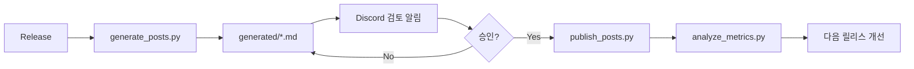

# 앱 홍보 자동화 — 빠른 시작

## 한 줄 요약

GitHub Release 한 번 → **8개 채널 초안 자동 생성** → Discord 검토 알림 → 승인 후 **X/Reddit/블로그/Discord 자동 발행**

---

## 전체 순서도



---

## 파일 구조

```text
해오라기/
  앱_홍보_자동화_운영_가이드.md      # 원칙
  광고_실행_가이드.md                 # 실전 광고 방법
  README_자동_홍보_파이프라인.md      # 이 파일
  promo_automation/
    config.example.json
    common.py
    generate_posts.py      # 초안 생성
    publish_posts.py       # 발행
    publishers.py          # X/Reddit/블로그/Discord
    analyze_metrics.py     # KPI 리포트
    run_pipeline.py        # 통합 실행
    requirements.txt
  .github/workflows/app_promo.yml
  generated/                 # 생성 결과 (gitignore 권장)
```

---

## 5분 세팅

1. `promo_automation/config.example.json` → `config.json` 복사
2. `app.name`, `app.description`, `play_store_url`, `keywords` 수정
3. GitHub Secrets 등록 (OPENAI_API_KEY 필수)
4. Release 생성 또는 Actions 수동 실행

---

## 명령어

```bash
cd promo_automation
pip install -r requirements.txt

# 생성 + 검토알림 + KPI
python run_pipeline.py --all

# 검토 후 실제 발행
python run_pipeline.py --publish --approve
```

---

## 자동 vs 수동

| 플랫폼 | 자동 | 비고 |
|--------|------|------|
| Google Play | 수동 | Play Console 붙여넣기 |
| Reddit | 자동 | 검토 후 |
| X | 자동 | 검토 후 |
| Threads | 수동 | 앱에서 직접 |
| YouTube Shorts | 수동 | 대본만 자동 |
| TikTok | 수동 | 대본만 자동 |
| Discord | 자동 | Webhook |
| 블로그 | 자동 | WordPress draft |

자세한 광고 전략은 `광고_실행_가이드.md` 참고.
플랫폼별 상세 규칙·알고리즘·금지 행동은 `플랫폼_운영_상세_가이드.md` 참고.
