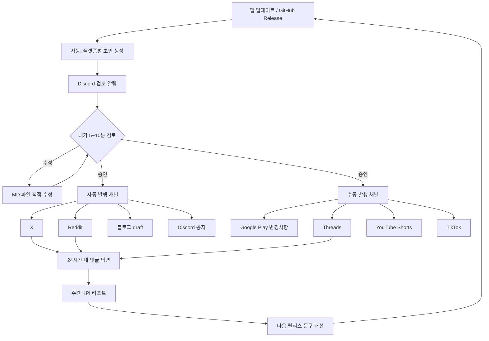

# 앱 광고 실행 가이드 (실전)

> 목표: 밴 없이, 꾸준히, 측정 가능하게 앱을 알린다.

---

## 1. 전체 광고 흐름 (순서도)



---

## 2. 4주 론칭 플랜

### 1주차: 기반 세팅 (광고 거의 안 함)

| 요일 | 할 일 |
|------|--------|
| 월 | Play 스토어 설명/스크린샷 정리, 키워드 5개 선정 |
| 화 | Reddit 계정 활동 시작 (댓글 3~5개, 글 X) |
| 수 | X/Threads 프로필에 앱 소개 1줄 + 링크 |
| 목 | Discord 서버 채널 구조 만들기 (#공지 #피드백 #잡담) |
| 금 | 블로그 첫 글 1개 (문제 해결형) |
| 주말 | Shorts/TikTok용 15초 영상 1개 촬영 |

### 2주차: 소프트 런칭

| 요일 | 할 일 |
|------|--------|
| 월 | Reddit 개발기 글 1개 (피드백 요청) |
| 화 | X 업데이트/개발 과정 1회 |
| 수 | Threads 질문형 글 1개 |
| 목 | Discord에서 기능 질문 던지기 |
| 금 | 블로그 업데이트 글 1개 |
| 주말 | Shorts 1개 업로드 |

### 3주차: 업데이트 홍보 본격화

| 요일 | 할 일 |
|------|--------|
| Release | GitHub Release → 자동 파이프라인 실행 |
| +30분 | 생성된 MD 검토 후 승인 발행 |
| +24h | 모든 댓글 답변 |
| +48h | KPI 리포트 확인, 톤 조정 |

### 4주차: 반복 + 개선

- 잘 된 플랫폼에만 빈도 소폭 증가
- 안 된 플랫폼은 문구/포맷 변경
- 동일 문구 재사용 금지

---

## 3. 플랫폼별 "어떻게" 광고할지

### Google Play (검색 유입)

**목적**: 스토어 검색 + 업데이트 신뢰

**방법**:
1. 업데이트마다 변경사항에 "사용자 문제 → 해결" 구조
2. 스크린샷 1번에 핵심 가치, 2번에 사용 장면
3. 키워드는 제목/짧은 설명/변경사항에 자연스럽게

**자동화**: 초안 생성 → Play Console에 붙여넣기 (수동)

---

### Reddit (초기 사용자 + 피드백)

**목적**: 진짜 사용자 피드백, 초기 설치

**방법**:
1. 첫 2주는 홍보 글 금지, 댓글만
2. 글은 "I built...", "Looking for feedback" 톤
3. 서브레딧마다 다른 각도 (기술/인디/사용자 문제)
4. 하루 1개 서브레딧만

**자동화**: 초안 생성 → 검토 후 API 게시 가능

**주의**: 같은 글 복붙 = 밴 위험

---

### X (인지도 + 반복 노출)

**목적**: 짧은 노출, 개발자 브랜딩

**방법**:
1. 하루 1~3회, 짧게
2. 업데이트 / 버그 수정 / 개발 비하인드 번갈아
3. 영상 15초면 더 좋음
4. 링크는 매번 넣지 말고 3번 중 1번만

**자동화**: 검토 후 자동 트윗 가능

---

### Threads (대화형 노출)

**목적**: 댓글 유도, 가벼운 커뮤니티

**방법**:
1. "이 기능 있으면 쓰실 건가요?" 같은 질문형
2. 댓글에 1시간 내 답변
3. X와 비슷한 내용이면 문장 구조를 바꿔서

**자동화**: 초안만 (수동 게시)

---

### YouTube Shorts / TikTok (바이럴 가능성)

**목적**: 신규 유저 대량 노출

**방법**:
1. 15~30초, 첫 3초에 결과/재미 장면
2. 자막 필수 (무음 시청 많음)
3. "문제 상황 → 앱으로 해결" 1컷 스토리
4. 업데이트마다 새 영상 (같은 영상 반복 X)

**자동화**: 대본/자막/해시태그 생성 → 영상은 직접 촬영/편집

---

### Discord (리텐션)

**목적**: 기존 유저 유지, 피드백 수집

**방법**:
1. 공지 20% : 대화 80%
2. 업데이트는 짧게 + 질문 1개
3. 버그 제보 채널 운영

**자동화**: Webhook으로 공지 가능

---

### 블로그 (SEO 장기 유입)

**목적**: 검색으로 매일 조금씩 유입

**방법**:
1. "OO 문제 해결 방법" 제목
2. 앱은 70% 글 끝부분에 자연스럽게 소개
3. 스크린샷 2~3장

**자동화**: WordPress draft 자동 생성 가능

---

## 4. 업데이트 1회당 실제 작업 순서

```text
1) GitHub Release 생성
2) Actions 자동 실행 (또는 로컬 run_pipeline)
3) generated/폴더 MD 검토·수정
4) 발행:
   - 자동: python run_pipeline.py --publish --approve
   - 수동: manual_publish_checklist.md 체크
5) 24시간 내 댓글 답변
6) analyze_metrics.py로 리포트 확인
```

---

## 5. 밴 안 당하는 황금 규칙

1. 같은 글 여러 곳 복붙 금지
2. 자동 댓글/DM 금지
3. 하루 게시량 천천히 증가
4. Reddit은 계정부터 워밍업
5. AI 초안도 반드시 사람이 검토

---

## 6. KPI 보는 법

| 지표 | 어디서 | 개선 방법 |
|------|--------|-----------|
| 노출 | X/Reddit/Shorts | 첫 문장·썸네일 변경 |
| 클릭률 | 링크 클릭 | CTA 문구 변경 |
| 스토어 방문 | Play Console | 스토어 설명/스크린샷 |
| 설치 | Play Console | 스토어 전환율 개선 |
| 7일 유지 | Play Console | 온보딩/핵심 기능 개선 |

---

## 7. 계정 정보 넣는 곳

GitHub Repository → Settings → Secrets:

| Secret 이름 | 용도 |
|-------------|------|
| OPENAI_API_KEY | 초안 생성 |
| DISCORD_WEBHOOK_URL | 검토 알림 + 공지 |
| X_API_KEY / X_API_SECRET | X 게시 |
| X_ACCESS_TOKEN / X_ACCESS_TOKEN_SECRET | X 게시 |
| REDDIT_CLIENT_ID / REDDIT_CLIENT_SECRET | Reddit |
| REDDIT_USERNAME / REDDIT_PASSWORD | Reddit |
| BLOG_API_TOKEN | WordPress |

로컬 실행 시 `.env` 파일 사용:

```env
OPENAI_API_KEY=sk-...
DISCORD_WEBHOOK_URL=https://discord.com/api/webhooks/...
```

---

## 8. 로컬 실행 명령어

```bash
cd promo_automation
pip install -r requirements.txt
cp config.example.json config.json
# config.json 앱 정보 수정

# 전체 (생성 + 알림 + 리포트)
python run_pipeline.py --all

# 검토 후 발행
python run_pipeline.py --publish --approve

# 시뮬레이션만
python run_pipeline.py --publish --approve --dry-run
```
