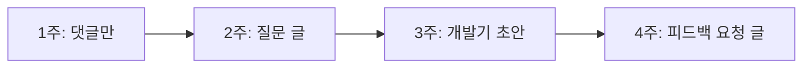
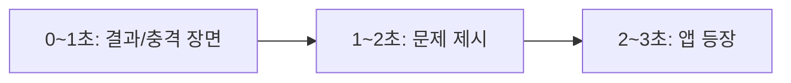
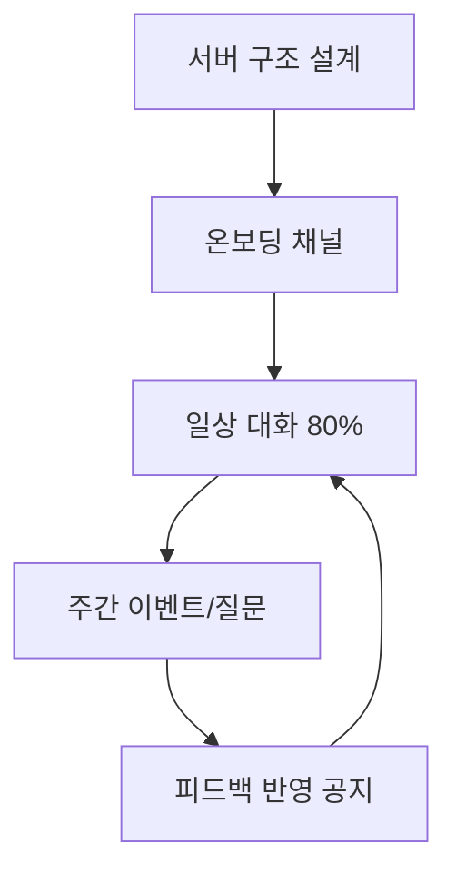
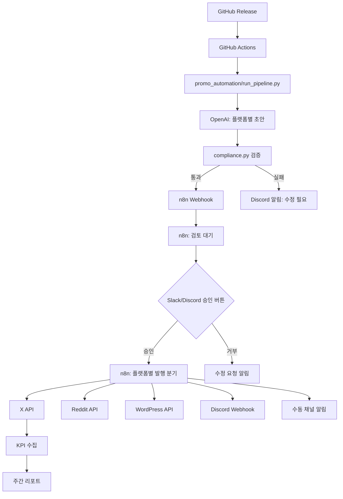

# 플랫폼 운영 상세 가이드

> 자동화 파이프라인이 반드시 지켜야 할 플랫폼별 규칙·알고리즘·금지 행동을 정리한 문서입니다.
> `promo_automation/platform_rules.py`와 `compliance.py`가 이 문서를 코드로 강제합니다.

---

## 목차

1. [Reddit](#1-reddit)
2. [X](#2-x)
3. [Threads](#3-threads)
4. [YouTube Shorts](#4-youtube-shorts)
5. [TikTok](#5-tiktok)
6. [Discord](#6-discord)
7. [Google Play ASO](#7-google-play-aso)
8. [GitHub Actions + AI + n8n 파이프라인](#8-github-actions--ai--n8n-파이프라인)
9. [플랫폼 API & 이용약관 준수 자동화](#9-플랫폼-api--이용약관-준수-자동화)
10. [절대 하면 안 되는 행동 체크리스트](#10-절대-하면-안-되는-행동-체크리스트)

---

## 1. Reddit

### 1-1. 서브레딧별 허용/금지 (대표 예시)

| 서브레딧 | 허용 | 금지/주의 |
|----------|------|-----------|
| r/androiddev | 기술 개발기, 아키텍처, 오픈소스 | 직접 홍보, APK 링크만 던지기 |
| r/IndieDev | 인디 개발 여정, 피드백 요청 | 동일 글 반복, 다운로드 링크만 |
| r/SideProject | 사이드 프로젝트 소개 (규칙 확인 필수) | 스팸성 셀프 프로모션 |
| r/playmygame | 게임 홍보 전용 (규칙 엄격) | 규정 외 포맷, 과장 광고 |
| r/alphaandbetausers | 베타 테스터 모집 | 완성 앱 무차별 홍보 |

**운영 원칙**: 글 올리기 전 **반드시** 해당 서브레딧 `About > Rules` + `Wiki` 확인.
`config.json`의 `subreddit_rules`에 서브레딧별 허용 여부를 등록해 두세요.

### 1-2. 카르마 쌓는 방법 (워밍업 2~4주)



| 주차 | 행동 | 목표 |
|------|------|------|
| 1주 | 관련 글에 유용한 댓글 3~5개/일 | 계정 신뢰도 |
| 2주 | 질문형 글 1~2개 (앱 언급 X) | 커뮤니티 참여 증명 |
| 3주 | "만들고 있는 중" 개발기 (링크 없이) | 자연스러운 노출 |
| 4주 | 피드백 요청 + 스토어 링크 1회 | 초기 유저 확보 |

- 업보트/다운보트 조작, 다중 계정 사용 **절대 금지**
- 카르마 부족 시 일부 서브레딧은 글 작성 자체가 차단됨 → `min_karma` 확인

### 1-3. 삭제·밴을 피하는 운영

| 위험 행동 | 결과 | 대안 |
|-----------|------|------|
| 동일 글 여러 서브레딧 복붙 | 스팸 삭제, 계정 밴 | 서브레딧마다 각도·문장 완전 변경 |
| 링크만 있는 제목 | 즉시 삭제 | 스토리 먼저, 링크는 본문 하단 |
| 하루 3개 이상 홍보 글 | shadowban | 하루 1개 서브레딧, 주 2~3회 |
| 자동 댓글/DM | 영구 밴 | 댓글은 100% 수동 |
| 신규 계정에 바로 링크 | 필터링/삭제 | 2주 워밍업 후 링크 |

**자동화 제한 (코드 강제)**:
- `max_posts_per_day: 1`
- `min_account_age_days: 14` 미만이면 API 발행 차단
- 동일 본문 해시 중복 게시 차단

---

## 2. X

### 2-1. 알고리즘에 맞는 게시 주기

| 시간대 (KST) | 이유 |
|--------------|------|
| 08:00~09:00 | 출근 전 스크롤 |
| 12:00~13:00 | 점심 시간 |
| 20:00~22:00 | 저녁 피크 |

- **하루 1~3회**, 간격 최소 **3시간**
- 주말은 평일 대비 30% 감소 권장 (스팸 인식 방지)
- 연속 트윗(스레드)은 3~5개 이내

### 2-2. 해시태그 사용

| 규칙 | 설명 |
|------|------|
| 개수 | 1~2개 (3개 이상은 스팸 인식) |
| 위치 | 본문 끝 |
| 금지 | 무관한 트렌드 해시태그 끼워넣기 |
| 권장 | `#인디게임` `#앱개발` 등 니치 태그 |

### 2-3. 영상 길이

| 형식 | 권장 길이 | 비고 |
|------|-----------|------|
| 일반 영상 | 15~45초 | 완시청률 중요 |
| GIF | 3~6초 | 루프 가능하면 유리 |
| 링크 카드 | 텍스트 100자 이내 | 링크는 3번 중 1번만 |

### 2-4. 자동화 시 주의사항

- X API 유료 플랜 필요 (Free tier는 게시 제한)
- **동일 문구 반복** → 계정 제한
- 자동 리트윗/좋아요/팔로우 **금지** (ToS 위반)
- `--approve` 없이 자동 발행 차단 (코드 강제)
- `max_posts_per_day: 3` 초과 시 발행 거부

---

## 3. Threads

### 3-1. 도달률을 높이는 글 구조

```text
[1줄 후킹 질문 또는 공감 문장]
[2~3줄 개발 비하인드 / 문제 상황]
[1줄 사용자에게 던지는 질문]
[선택: 이미지 1장]
```

| 요소 | 효과 |
|------|------|
| 질문으로 끝내기 | 댓글 유도 → 알고리즘 부스트 |
| 150~300자 | 너무 길면 이탈 |
| 이미지 1장 | 텍스트만 대비 노출 ↑ |
| 첫 30분 내 댓글 답변 | 초기 참여 신호 |

### 3-2. 금지되는 행동

| 금지 | 이유 |
|------|------|
| X 글 그대로 복붙 | 중복 콘텐츠 필터 |
| 링크만 반복 게시 | 스팸 처리 |
| 팔로우/언팔로우 자동화 | 계정 정지 |
| 가짜 참여 유도 (댓글 이벤트 남발) | 신고 대상 |
| 하루 5회 이상 홍보 | 도달률 급감 |

**자동화**: API 제한적 → **초안만 생성, 수동 게시** (현재 파이프라인 기본값)

---

## 4. YouTube Shorts

### 4-1. 썸네일

- Shorts는 자동 프레임이지만, **첫 프레임을 썸네일처럼** 디자인
- 밝은 대비, 큰 텍스트 3~5단어
- 얼굴/앱 UI가 보이면 CTR ↑

### 4-2. 제목

| 좋음 | 나쁨 |
|------|------|
| "이 설정 하나로 배터리 2배" | "우리 앱 업데이트했어요" |
| 숫자·결과 포함 | 50자 초과 |
| 검색 키워드 1개 자연 포함 | 클릭베이트 과장 |

### 4-3. 첫 3초 구성



- 0초: 가장 임팩트 있는 결과 화면
- 1초: "이거 알면..." / "이 문제 겪어봤어?"
- 2~3초: 앱 UI 또는 플레이 장면

### 4-4. 저작권 주의사항

| 항목 | 규칙 |
|------|------|
| BGM | YouTube Audio Library 또는 라이선스 확인된 음원 |
| 트렌드 음원 | Shorts에도 저작권 클레임 가능 → 상업용 주의 |
| 게임/앱 화면 | 본인 앱은 OK, 타사 UI 무단 사용 금지 |
| 폰트/이미지 | 상업 이용 가능 라이선스만 |

**자동화**: 대본·제목·설명란·해시태그만 생성. 영상 업로드는 수동.

---

## 5. TikTok

### 5-1. 추천 알고리즘 핵심 신호

| 신호 | 가중치 | 대응 |
|------|--------|------|
| 완시청률 | 높음 | 15~20초로 짧게 |
| 재시청 | 높음 | 루프 가능한 엔딩 |
| 댓글/공유 | 중간 | 질문 자막 삽입 |
| 팔로우 전환 | 중간 | 프로필에 앱 링크 |
| 해시태그 | 낮음 | 3~5개 니치 태그 |

### 5-2. 반복 업로드 시 주의점

| 행동 | 결과 |
|------|------|
| 동일 영상 재업로드 | 도달 0에 가까워짐 |
| 워터마크 있는 영상 (다른 플랫폼 로고) | 노출 제한 |
| Shorts 영상 그대로 업로드 | 중복 콘텐츠 필터 |
| 하루 5개 이상 업로드 | 스팸 인식 |

**권장**: Shorts와 TikTok은 **같은 소스, 다른 편집** (비율·자막·BGM 변경)

---

## 6. Discord

### 6-1. 커뮤니티 성장 운영법



| 채널 | 역할 |
|------|------|
| #환영 / #규칙 | 신규 유저 온보딩 |
| #잡담 | 일상 대화 (가장 활발해야 함) |
| #피드백 | 버그/기능 제안 |
| #업데이트 | 공지 (전체의 20% 이하) |
| #미디어 | 스크린샷/영상 공유 |

| 성장 전략 | 설명 |
|-----------|------|
| 공지 : 대화 = 2 : 8 | 공지만 하면 이탈 |
| 주 1회 AMA/질문 | 참여 유도 |
| 피드백 반영 시 공지 | "여러분 의견 반영했어요" |
| 역할(Role) 부여 | 베타 테스터, 기여자 등 |
| 타 서버 무단 홍보 | 밴 사유 |

**자동화**: Webhook으로 #업데이트 공지만. 대화·댓글은 수동.

---

## 7. Google Play ASO

### 7-1. 키워드 최적화

| 위치 | 규칙 |
|------|------|
| 앱 제목 (30자) | 브랜드명 + 핵심 키워드 1개 |
| 짧은 설명 (80자) | 핵심 가치 + 키워드 2~3개 |
| 긴 설명 (4000자) | 키워드 5~8개 자연 반복 (과밀 X) |
| 변경사항 | 업데이트 키워드 포함 |

### 7-2. 스크린샷

| 순서 | 내용 |
|------|------|
| 1번 | 핵심 가치 (한 문장 + UI) |
| 2번 | 주요 기능 사용 장면 |
| 3번 | 차별점/비교 |
| 4~8번 | 세부 기능 |

- A/B 테스트: Google Play Console > 스토어 등록정보 실험
- 텍스트 오버레이: 짧고 큰 글씨
- 기기 프레임 사용 권장

### 7-3. 설명 최적화

```text
[1문단] 사용자 문제 정의
[2문단] 앱이 해결하는 방법
[3문단] 주요 기능 3~5개 (불릿)
[4문단] 업데이트/신뢰 요소
```

- 키워드 스터핑 금지 (스토어 정책 위반)
- 경쟁 앱 이름 언급 금지
- 허위 다운로드 수/순위 주장 금지

---

## 8. GitHub Actions + AI + n8n 파이프라인

### 8-1. 전체 아키텍처



### 8-2. 역할 분담

| 도구 | 역할 |
|------|------|
| **GitHub Actions** | Release 트리거, 초안 생성, compliance 검증 |
| **OpenAI** | 플랫폼별 맞춤 초안 생성 |
| **n8n** | 검토 워크플로, 승인 후 발행 분기, 예약 발행, KPI 집계 |
| **Discord/Slack** | 검토 알림, 승인/거부 UI |

### 8-3. n8n 연동 방법

1. n8n에서 Webhook 노드 생성 → URL 복사
2. `config.json`의 `n8n.webhook_url_env`에 등록
3. Release 후 Actions가 n8n Webhook 호출
4. n8n 워크플로:
   - Discord에 초안 링크 + 승인/거부 버튼
   - 승인 시 → X/Reddit/블로그 API 노드 실행
   - 거부 시 → 수정 요청 메시지

예시 워크플로: `promo_automation/n8n_workflow_example.json`

### 8-4. 로컬 실행 vs CI

| 환경 | 용도 |
|------|------|
| GitHub Actions | Release 자동 트리거 |
| n8n (셀프호스트/클라우드) | 검토·발행·예약 |
| 로컬 | 테스트, dry-run |

---

## 9. 플랫폼 API & 이용약관 준수 자동화

### 9-1. 플랫폼별 API 요약

| 플랫폼 | API | 자동화 가능 범위 | ToS 핵심 |
|--------|-----|------------------|----------|
| Reddit | PRAW (OAuth) | 글 게시 (검토 후) | 스팸 금지, rate limit 준수 |
| X | Tweepy v2 | 트윗 게시 | 자동 engagement 금지 |
| WordPress | REST API | draft/publish | 스팸 콘텐츠 금지 |
| Discord | Webhook | 채널 메시지 | 봇 스팸 금지 |
| Google Play | Play Developer API | 메타데이터 (복잡) | 허위 설명 금지 |
| YouTube | Data API v3 | 업로드 가능 | 저작권 준수 |
| TikTok | Content Posting API | 제한적 승인 필요 | 중복 콘텐츠 금지 |
| Threads | Meta Graph API | 제한적 | 자동 engagement 금지 |

### 9-2. 코드에서 강제하는 ToS 준수

| 검증 | 파일 | 설명 |
|------|------|------|
| `--approve` 없이 발행 차단 | `run_pipeline.py` | 사람 검토 필수 |
| 일일 게시 한도 | `compliance.py` | 플랫폼별 max_posts_per_day |
| 중복 본문 차단 | `compliance.py` | 해시 비교 |
| 금지 문구 필터 | `compliance.py` | "무료 다운로드!!!" 등 |
| Reddit 워밍업 기간 | `compliance.py` | min_account_age_days |
| 자동 댓글/DM 차단 | `publishers.py` | 댓글 API 미구현 (의도적) |
| dry-run 모드 | 전체 | 테스트 시 실제 API 호출 없음 |

### 9-3. Rate Limit 준수

| 플랫폼 | 제한 | 코드 기본값 |
|--------|------|-------------|
| Reddit | 1 post / 10분 권장 | 1 post / day |
| X | 플랜별 상이 | 3 post / day |
| Discord Webhook | 30 msg / min | 5 msg / min |
| WordPress | 서버별 상이 | 1 post / release |

---

## 10. 절대 하면 안 되는 행동 체크리스트

### 자동화 전 체크 (매 Release마다)

- [ ] 동일 글을 2개 이상 플랫폼에 복붙하지 않았는가?
- [ ] AI 초안을 사람이 검토·수정했는가?
- [ ] Reddit 계정 워밍업 기간(14일+)을 지켰는가?
- [ ] 하루 게시 한도를 초과하지 않았는가?
- [ ] 자동 댓글/DM/좋아요/팔로우를 사용하지 않았는가?
- [ ] 허위 리뷰/가짜 계정/리뷰 구매를 하지 않았는가?
- [ ] 저작권 없는 BGM/이미지를 사용하지 않았는가?
- [ ] 서브레딧 규칙을 확인했는가?
- [ ] 링크를 매 게시마다 넣지 않았는가?
- [ ] `--approve` 플래그로 승인 후 발행했는가?

### 스팸으로 인식되는 행동 (즉시 중단)

| 행동 | 위험도 |
|------|--------|
| 동일 문구 3회 이상 반복 | 🔴 높음 |
| 1시간 내 3개 이상 홍보 글 | 🔴 높음 |
| 무관 해시태그 5개+ | 🟡 중간 |
| 신규 계정에 링크 게시 | 🔴 높음 |
| 자동 DM | 🔴 영구 밴 |
| 가짜 참여 유도 이벤트 | 🟡 중간 |
| 타 플랫폼 워터마크 영상 업로드 | 🟡 중간 |
| 키워드 스터핑 (Play) | 🟡 스토어 경고 |

### 파이프라인 안전 장치 요약

```text
Release → AI 초안 → compliance 검증 → [실패 시 중단]
  → Discord 검토 알림 → 사람 검토 → --approve → 발행
  → 발행 로그 저장 → KPI 리포트
```

**원칙**: 자동화는 "초안 생성 + 검증 + 승인 후 발행"까지만.
댓글, DM, 커뮤니티 대화, 영상 편집은 항상 사람이 합니다.
